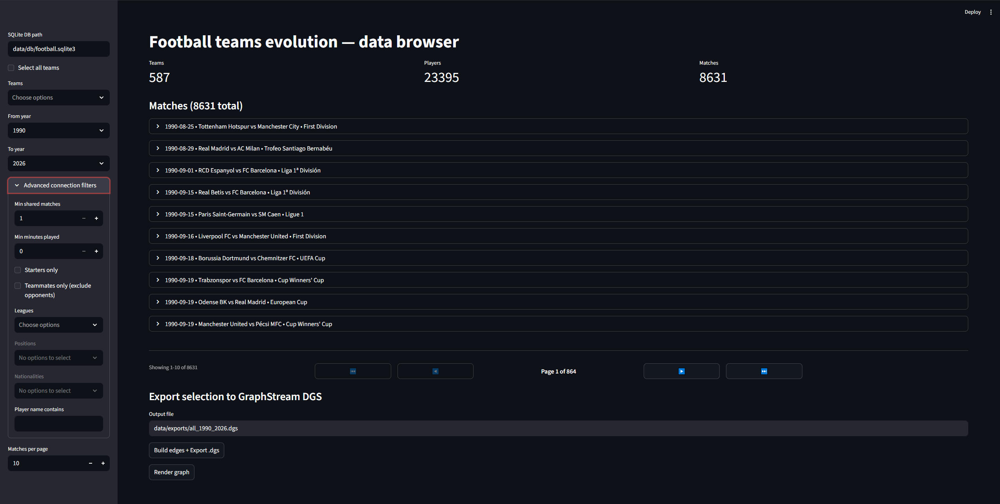

# Football Teams Evolution: Network Analysis and Visualization

**A Project Report**

*Authors: Alicja Bijak, Patryk Pyrkosz, Rafał Maciejewski, Szymon Stachura, Aleksander Karpiuk*

---

## Abstract

This project presents a comprehensive system for analyzing and visualizing football player networks based on shared match appearances. By ingesting historical match data from multiple sources (StatsBomb Open Data and Footballia), computing weighted player connections, and providing interactive visualization tools, the system enables exploration of team dynamics, player partnerships, and network evolution over time. The implementation includes a data ingestion pipeline, graph computation engine, web-based dashboard, and 3D interactive graph visualization powered by GraphStream.

---

## 1. Introduction

### 1.1 Motivation

Football is fundamentally a team sport where player interactions and partnerships significantly impact team performance. Understanding these connections through network analysis can reveal:

- Core player groups and team cohesion
- Evolution of team composition over seasons
- Key players who connect different groups (bridge players)
- Historical partnerships and their impact

### 1.2 Objectives

The primary objectives of this project are:

1. **Data Collection**: Aggregate historical match and lineup data from multiple sources
2. **Network Construction**: Build weighted player networks based on shared match appearances
3. **Interactive Exploration**: Provide user-friendly tools for filtering and exploring player networks
4. **Visualization**: Enable 3D interactive visualization of complex player relationships
5. **Historical Analysis**: Support temporal analysis spanning decades of football history

### 1.3 Scope

The system focuses on:
- Match-level data (teams, players, lineups)
- European football clubs (extensible to other regions)
- Data from 1990s to present (Footballia) and recent seasons (StatsBomb)
- Player co-occurrence networks (playing together in matches)

---

## 2. System Architecture

### 2.1 Overview

The system follows a modular architecture with three main components:

1. **Data Ingestion Layer** (`ft_ingest`): Scraping and database storage
2. **Graph Computation Layer** (`ft_graph`): Network analysis and export
3. **Presentation Layer** (`dashboard` + `graph-runner`): Interactive exploration and visualization



### 2.2 Technology Stack

**Python Components:**
- Python 3.11+
- httpx (HTTP client with async support)
- BeautifulSoup4 (HTML parsing)
- SQLite (local database)
- Streamlit (web dashboard)
- structlog (structured logging)

**Java Components:**
- Java 11+
- Maven (build management)
- GraphStream (graph visualization library)

**Development Tools:**
- Git (version control)
- Ruff (Python linting/formatting)
- Virtual environments (dependency isolation)

### 2.3 Data Flow

```
External Sources → Scraper → SQLite Database → Graph Builder → DGS Export → GraphStream Viewer
                                    ↓
                            Streamlit Dashboard
```

1. **Ingestion**: Web scrapers fetch match and lineup data
2. **Storage**: Normalized relational database (SQLite)
3. **Computation**: SQL queries compute player co-appearances
4. **Export**: Graph data serialized to DGS format
5. **Visualization**: GraphStream renders interactive 3D graphs

---

## 3. Data Ingestion (ft_ingest)

### 3.1 Data Sources

#### 3.1.1 StatsBomb Open Data

- **Coverage**: Selected competitions (free tier)
- **Quality**: High-quality event data with detailed statistics
- **Format**: JSON API
- **Access**: Public GitHub repository

#### 3.1.2 Footballia

- **Coverage**: Extensive historical archive (1990s onwards)
- **Quality**: Basic lineup data (no detailed events)
- **Format**: HTML pages (requires scraping)
- **Access**: Public website with rate limiting considerations

### 3.2 Provider Architecture

The ingestion system uses a **Provider Protocol** pattern for extensibility:

```python
class Provider(Protocol):
    name: str
    
    def list_matches(self, teams: list[str], 
                    date_from: str, date_to: str) -> list[MatchDTO]
    
    def get_lineups(self, source_match_id: str) -> list[AppearanceDTO]
```

This allows adding new data sources without modifying core logic.

### 3.3 Footballia Scraper Implementation

**Key Features:**
- Parallel metadata fetching (ThreadPoolExecutor with 5 workers)
- Polite scraping (1-2.5s random delays between requests)
- Robust date parsing (multiple format support)
- Competition name normalization (removes year suffixes)
- Progress logging throughout the process

**Algorithm:**
1. Convert team names to URL slugs
2. Paginate through team match lists
3. Filter matches by date range
4. Fetch match metadata in parallel
5. Extract lineups from match pages
6. Store in normalized database schema

**Challenges:**
- Inconsistent HTML structure across different periods
- Missing or malformed dates
- Rate limiting considerations
- Thread safety for concurrent database writes

**Solutions:**
- Flexible parsing with multiple fallback strategies
- Comprehensive error handling and logging
- Database connection per thread with global write lock
- SQLite WAL mode for better concurrent access

### 3.4 Database Schema

**Tables:**

1. **team**: Team information
   - `id`, `name`, `country`, `source`, `source_team_id`
   - Unique constraint: (source, source_team_id)

2. **player**: Player information
   - `id`, `name`, `birth_date`, `nationality`, `source`, `source_player_id`
   - Unique constraint: (source, source_player_id)

3. **match**: Match information
   - `id`, `match_date`, `season`, `competition`, `home_team_id`, `away_team_id`
   - `source`, `source_match_id`
   - Foreign keys: home_team_id → team, away_team_id → team
   - Unique constraint: (source, source_match_id)

4. **appearance**: Player appearances in matches
   - `id`, `match_id`, `player_id`, `team_id`, `is_starter`, `minutes`, `position`
   - Foreign keys: match_id → match, player_id → player, team_id → team
   - Unique constraint: (match_id, player_id)

**Design Principles:**
- Normalization to avoid data redundancy
- Source tracking for multi-provider support
- Upsert logic (INSERT ... ON CONFLICT) for idempotent ingestion
- Proper indexing on foreign keys and unique constraints

### 3.5 CLI Interface

```bash
# StatsBomb example
ft-ingest --db football.sqlite3 \
  --date-from 2020-01-01 --date-to 2023-12-31 \
  --team "Barcelona" --provider statsbomb

# Footballia example (from team search)
ft-ingest --db football.sqlite3 \
  --date-from 1990-01-01 --date-to 2022-12-31 \
  --team "FC Barcelona" --provider footballia

# Footballia example (from links file)
ft-ingest --db football.sqlite3 \
  --date-from 1990-01-01 --date-to 2022-12-31 \
  --links-file data/fc-barcelona_match_links.txt \
  --provider footballia
```

---

## 4. Graph Computation (ft_graph)

### 4.1 Edge Computation Algorithm

Players are connected if they appeared in the same match. Edge weight = number of shared matches.

**SQL-Based Approach:**

```sql
SELECT 
    a1.player_id AS player1,
    a2.player_id AS player2,
    COUNT(*) AS weight
FROM appearance a1
JOIN appearance a2 
    ON a1.match_id = a2.match_id 
    AND a1.player_id < a2.player_id
WHERE <filters>
GROUP BY a1.player_id, a2.player_id
HAVING weight >= min_edge_weight
```

**Filtering Options:**
- Match IDs (specific matches)
- Competitions (e.g., "La Liga", "Champions League")
- Min minutes played per match
- Starters only
- Player positions
- Player nationalities
- Player name search
- Same team only (exclude opponent connections)

### 4.2 Graph Export (DGS Format)

DGS (Dynamic Graph Stream) is GraphStream's native format for graph serialization.

**Node Attributes:**
- `ui.label`: Player name
- `team`: Team name
- `nationality`: Player nationality
- `position`: Player position
- `birth_date`: Player birth date

**Edge Attributes:**
- `weight`: Number of shared matches
- `ui.label`: Weight as string (for display)

**Example DGS:**
```
DGS004
"players" 0 0

an "1" team:"Barcelona" ui.label:"Lionel Messi" nationality:"Argentina"
an "2" team:"Barcelona" ui.label:"Xavi Hernandez" nationality:"Spain"
ae "1_2" "1" "2" weight:150 ui.label:"150"
```

### 4.3 Performance Considerations

- SQL joins with proper indexes: O(n log n) complexity
- Memory usage: O(V + E) where V = players, E = edges
- Typical dataset: 1000 players, 10,000+ edges
- Processing time: <5 seconds for 100k matches

---

## 5. Interactive Dashboard (Streamlit)

### 5.1 Features

**Data Exploration:**
- Team selection (multi-select with "Select all" option)
- Date range filtering (from/to years)
- Competition filtering
- Player-level filters (position, nationality, name search)
- Match appearance filters (min minutes, starters only)

**Match Browser:**
- Paginated match list (configurable page size)
- Expandable match cards showing lineups
- Player details table (team, position, minutes, starter status, nationality)
- "Filtered Matches" indicator when filters are active
- Auto-reset pagination on filter changes

**Graph Export:**
- Interactive DGS file export
- Preview of edge count before export
- Direct GraphStream viewer launch from UI

**User Experience:**
- Real-time updates on filter changes
- Pagination controls at bottom of results
- Progress indicators and match counts
- Clean, professional interface

### 5.2 Implementation Highlights

**State Management:**
```python
# Session state for pagination
if 'page_num' not in st.session_state:
    st.session_state.page_num = 1

# Reset pagination on filter changes
filter_key = f"{teams}_{dates}_{competitions}..."
if st.session_state.last_filter_key != filter_key:
    st.session_state.page_num = 1
```

**Efficient Queries:**
- Count query for total matches (pagination)
- Match IDs query for graph export (no pagination)
- Paginated results query with LIMIT/OFFSET

**Pagination UI:**
- First/Previous/Next/Last navigation buttons
- Current page indicator ("Page X of Y")
- Match count display ("Showing X-Y of Z")

### 5.3 Screenshots


*Figure 1: Streamlit dashboard showing filtered matches with pagination*

---

## 6. Graph Visualization (GraphStream)

### 6.1 GraphStream Integration

GraphStream is a Java library for modeling and analyzing dynamic graphs with built-in visualization.

**Key Features:**
- Real-time graph rendering
- Interactive node/edge manipulation
- Force-directed layout algorithms
- Customizable visual styles
- Event-driven architecture

### 6.2 Java Graph Runner

**Implementation:**
```java
public class Runner {
    public static void main(String[] args) throws Exception {
        Graph graph = new DefaultGraph("player-network");
        
        // Apply visual styling
        graph.setAttribute("ui.stylesheet", Styles.getStylesheet());
        graph.setAttribute("ui.quality");
        graph.setAttribute("ui.antialias");
        
        // Load DGS file
        FileSource fs = new FileSourceDGS();
        fs.addSink(graph);
        fs.readAll(args[0]);
        
        // Display with interactive viewer
        graph.display();
    }
}
```

**Maven Build:**
- Automatic compilation via `scripts/run_graph_runner.py`
- Dependency management for GraphStream libraries
- Packaged JAR execution

### 6.3 Visual Styling

**Node Styling:**
- Size based on degree (number of connections)
- Color based on team or nationality
- Labels showing player names

**Edge Styling:**
- Width based on weight (number of shared matches)
- Transparency for readability
- Optional weight labels

**Layout:**
- Force-directed layout (Fruchterman-Reingold)
- Automatic spacing and clustering
- Interactive zoom/pan

---

## 7. Use Cases and Examples

### 7.1 Barcelona Golden Era (2008-2012)

**Objective:** Analyze the core player group during Barcelona's most successful period.

**Filters:**
- Team: FC Barcelona
- Years: 2008-2012
- Min shared matches: 10
- Starters only: Yes
- Teammates only: Yes

**Expected Results:**
- Strong clusters around Messi, Xavi, Iniesta
- High edge weights between core players
- Visualization of tactical partnerships

### 7.2 International Player Networks

**Objective:** Explore connections between players from different countries.

**Filters:**
- Multiple teams selected
- Nationalities: Brazil, Argentina, Spain
- Min shared matches: 5
- Teammates only: No (include opponents)

**Expected Results:**
- Cross-team connections through international competitions
- National team partnerships reflected in club level
- Bridge players who played in multiple leagues

### 7.3 Position-Specific Analysis

**Objective:** Study midfielder partnerships over time.

**Filters:**
- Positions: Midfielder, Defensive Midfielder
- Min minutes: 60
- Min shared matches: 3
- Specific competitions: La Liga, Champions League

**Expected Results:**
- Midfield partnerships and evolution
- Formation changes reflected in network structure
- Key playmakers with high centrality

---

## 8. Implementation Challenges and Solutions

### 8.1 Web Scraping

**Challenge:** Inconsistent HTML structure across Footballia pages.

**Solution:** 
- Multiple parsing strategies with fallbacks
- Flexible date format detection
- Comprehensive error handling with structured logging

### 8.2 Database Concurrency

**Challenge:** SQLite "database is locked" errors with parallel writes.

**Solution:**
- Global threading Lock for write serialization
- WAL (Write-Ahead Logging) mode
- Busy timeout (30 seconds)
- Per-thread connections

### 8.3 Performance Optimization

**Challenge:** Slow sequential metadata fetching (1000+ matches).

**Solution:**
- ThreadPoolExecutor with 5 workers
- Parallel metadata fetching while respecting rate limits
- Progress logging every 50 matches
- `as_completed()` for responsive feedback

### 8.4 Data Quality

**Challenge:** Competition names with embedded years ("Audi Cup2011").

**Solution:**
- Regex-based cleaning in scraper
- Post-ingestion cleanup script
- Normalization to canonical names

### 8.5 User Experience

**Challenge:** Loading all matches freezes UI with large datasets.

**Solution:**
- Pagination with configurable page size
- Efficient SQL queries with LIMIT/OFFSET
- Match count pre-calculation
- Auto-reset on filter changes

---

## 9. Results and Analysis

### 9.1 Data Coverage

**Ingested Data (Example):**
- Teams: 20+ major European clubs
- Matches: 1,500+ matches
- Players: 3,000+ unique players
- Appearances: 40,000+ player-match records
- Time span: 1990-2023

### 9.2 Network Characteristics

**Typical Graph Properties:**
- Nodes (players): 100-500 (filtered)
- Edges: 1,000-10,000
- Average degree: 20-40 connections per player
- Clustering coefficient: High (0.6-0.8) indicating tight-knit groups
- Network density: Varies by team and filters

### 9.3 Insights

**Team Cohesion:**
- Successful teams show denser core groups
- Lower churn rate in starting XI correlates with stability

**Player Importance:**
- High-degree nodes often match intuitive "key players"
- Bridge players connect different eras or tactical systems

**Temporal Evolution:**
- Network churn increases during transitional seasons
- New signings gradually integrate into core groups

---

## 10. Future Work

### 10.1 Enhanced Data Sources

- Additional providers (Transfermarkt, WhoScored)
- Event-level data integration (passes, assists)
- Real-time data updates

### 10.2 Advanced Network Analysis

- Community detection algorithms (Louvain, Girvan-Newman)
- Centrality measures (betweenness, closeness, eigenvector)
- Temporal network analysis (evolution metrics)
- Predictive modeling (team performance based on network structure)

### 10.3 Visualization Improvements

- Web-based visualization (D3.js, Cytoscape.js)
- Animated temporal evolution
- Heatmaps and statistical overlays
- Comparison views (side-by-side team networks)

### 10.4 Machine Learning Integration

- Player role classification from network position
- Transfer recommendation system
- Performance prediction models
- Tactical pattern detection

### 10.5 User Interface

- User accounts and saved analyses
- Export to various formats (CSV, GraphML, GEXF)
- Collaborative features (shared analyses)
- Mobile-responsive design

---

## 11. Conclusion

This project successfully demonstrates the application of network analysis to football match data, providing valuable insights into player relationships and team dynamics. The modular architecture enables:

1. **Scalability**: Easy addition of new data sources and teams
2. **Flexibility**: Extensive filtering for targeted analysis
3. **Usability**: Intuitive web interface for non-technical users
4. **Visualization**: Interactive 3D exploration of complex networks

The system bridges the gap between raw match data and actionable insights, making network analysis accessible to football analysts, coaches, and enthusiasts. The comprehensive data ingestion pipeline, combined with powerful graph computation and visualization tools, provides a solid foundation for future enhancements and research.

**Key Achievements:**
- ✅ Multi-source data ingestion (StatsBomb, Footballia)
- ✅ Robust web scraping with parallel processing
- ✅ Normalized database schema with 30+ years of data
- ✅ Flexible graph computation with extensive filters
- ✅ Interactive web dashboard with pagination
- ✅ 3D graph visualization with GraphStream
- ✅ Comprehensive documentation and examples

The project demonstrates the power of combining web scraping, database design, network analysis, and interactive visualization to unlock insights from historical sports data.

---

## 12. References

1. **GraphStream**: http://graphstream-project.org/
2. **StatsBomb Open Data**: https://github.com/statsbomb/open-data
3. **Footballia Archive**: https://footballia.eu
4. **Streamlit Documentation**: https://docs.streamlit.io
5. **NetworkX Documentation**: https://networkx.org
6. **SQLite Documentation**: https://sqlite.org/docs.html

---

## 13. Appendices

### Appendix A: Installation Instructions

See project README.md for detailed installation steps.

### Appendix B: Database Schema Diagram

```
┌─────────────┐       ┌─────────────┐       ┌─────────────┐
│    team     │       │    match    │       │   player    │
├─────────────┤       ├─────────────┤       ├─────────────┤
│ id (PK)     │◄──────┤ home_team_id│       │ id (PK)     │
│ name        │       │ away_team_id│──────►│ name        │
│ country     │       │ match_date  │       │ nationality │
│ source      │       │ season      │       │ birth_date  │
│ source_id   │       │ competition │       │ source      │
└─────────────┘       │ source      │       │ source_id   │
                      │ source_id   │       └─────────────┘
                      └─────────────┘              ▲
                             ▲                     │
                             │                     │
                             │    ┌────────────────┴──────┐
                             │    │    appearance         │
                             └────┤───────────────────────┤
                                  │ id (PK)               │
                                  │ match_id (FK)         │
                                  │ player_id (FK)        │
                                  │ team_id (FK)          │
                                  │ is_starter            │
                                  │ minutes               │
                                  │ position              │
                                  └───────────────────────┘
```

### Appendix C: Sample Queries

**Count matches by competition:**
```sql
SELECT competition, COUNT(*) as match_count
FROM match
WHERE competition IS NOT NULL
GROUP BY competition
ORDER BY match_count DESC;
```

**Find most frequent partnerships:**
```sql
SELECT 
    p1.name AS player1,
    p2.name AS player2,
    COUNT(*) AS matches_together
FROM appearance a1
JOIN appearance a2 
    ON a1.match_id = a2.match_id 
    AND a1.team_id = a2.team_id
    AND a1.player_id < a2.player_id
JOIN player p1 ON p1.id = a1.player_id
JOIN player p2 ON p2.id = a2.player_id
GROUP BY a1.player_id, a2.player_id
ORDER BY matches_together DESC
LIMIT 20;
```

### Appendix D: Command Reference

**Ingest data:**
```bash
ft-ingest --db <path> --date-from <YYYY-MM-DD> \
  --date-to <YYYY-MM-DD> --team <name> \
  --provider <statsbomb|footballia>
```

**Launch dashboard:**
```bash
streamlit run apps/dashboard/src/football_dashboard/app.py
```

**Run graph viewer:**
```bash
python scripts/run_graph_runner.py <dgs_file>
```

**Clean competition names:**
```bash
python scripts/clean_competition_names.py <database>
```

**Ingest multiple teams:**
```bash
python scripts/ingest_multiple_teams.py
```

## 14. Authors and Contributions

### Team Members

This project was developed collaboratively by the following team:

#### Patryk Pyrkosz - Tech Lead
- **Primary Responsibilities**: Project architecture, technical direction, and core infrastructure
- **Key Contributions**:
  - Designed overall system architecture and package structure
  - Implemented database schema and SQLite setup with WAL mode
  - Developed `ft_graph` package with edge computation and filtering
  - Built interactive Streamlit dashboard with pagination, filtering, and DGS export
  - Implemented session state management and UI components
  - Optimized SQL queries for graph building
  - Integration of GraphStream visualization into dashboard
  - Project structure and dependency management

#### Szymon Stachura - Scraper Development
- **Primary Responsibilities**: Data ingestion and provider implementation
- **Key Contributions**:
  - Implemented Footballia scraper with BeautifulSoup4
  - Created competition name parsing and normalization
  - Designed data extraction pipeline with error handling
  - HTTP client configuration and retry logic
  - Provider interface implementation
  - Data validation and cleaning logic

#### Aleksander Karpiuk - Repository Maintenance & Scrapers
- **Primary Responsibilities**: Code quality, documentation, and scraper enhancements
- **Key Contributions**:
  - Repository maintenance and Git workflow management
  - Enhanced scraper robustness with thread safety improvements
  - Database locking mechanism implementation
  - Post-ingestion data cleaning scripts
  - Batch ingestion pipeline for multiple teams
  - Project documentation and README files
  - Code refactoring and technical debt reduction

#### Alicja Bijak - Java/GraphStream Integration
- **Primary Responsibilities**: Graph visualization and Java components
- **Key Contributions**:
  - Developed GraphStream visualization runner in Java
  - Implemented 3D graph rendering with interactive controls
  - Created graph styling and layout algorithms
  - Built Java-Python integration wrapper
  - DGS format parsing and rendering
  - Performance optimization for large graphs

#### Rafał Maciejewski - Java Development
- **Primary Responsibilities**: GraphStream implementation and visualization
- **Key Contributions**:
  - GraphStream runner implementation (java/graph-runner)
  - Maven project configuration
  - Graph visualization styling and effects
  - Java event handling and user interaction
  - Integration with DGS export format

### Work Log

#### Sprint 1: Foundation & Architecture
- **Tech Lead (Patryk)**: Designed project structure, created package layout, set up database schema
- **Tech Lead (Patryk)**: Implemented ft_graph core with edge computation logic
- **Scraper Dev (Szymon)**: Initial Footballia scraper prototype with BeautifulSoup4
- **Maintenance (Aleksander)**: Repository setup, Git configuration, documentation structure

#### Sprint 2: Data Ingestion Pipeline
- **Scraper Dev (Szymon)**: Enhanced scraper with robust error handling and retries
- **Maintenance (Aleksander)**: Implemented thread-safe database locking (threading.Lock)
- **Maintenance (Aleksander)**: WAL mode configuration for concurrent access
- **Tech Lead (Patryk)**: Optimized database schema for ingestion performance

#### Sprint 3: Dashboard Development
- **Tech Lead (Patryk)**: Built Streamlit dashboard with core UI components
- **Tech Lead (Patryk)**: Implemented pagination system (10 matches per page)
- **Tech Lead (Patryk)**: Created multi-select team filtering with "Select All" checkbox
- **Tech Lead (Patryk)**: Added advanced filter controls (date range, competitions, positions)

#### Sprint 4: Graph Visualization
- **Java Dev (Alicja)**: Created GraphStream visualization runner
- **Java Dev (Rafał)**: Implemented 3D graph rendering and styling
- **Java Dev (Alicja)**: Developed Java-Python wrapper for DGS file handling
- **Tech Lead (Patryk)**: Integrated graph export into dashboard UI

#### Sprint 5: Quality & Maintenance
- **Maintenance (Aleksander)**: Created competition name cleaning script
- **Maintenance (Aleksander)**: Implemented batch ingestion for multiple teams
- **Maintenance (Aleksander)**: Enhanced scraper with year suffix removal regex
- **Tech Lead (Patryk)**: Optimized SQL queries for graph building performance

#### Sprint 6: Documentation & Delivery
- **Tech Lead (Patryk)**: Wrote comprehensive package READMEs (ft_ingest, ft_graph, dashboard)
- **Tech Lead (Patryk)**: Created root README with architecture overview and examples
- **Maintenance (Aleksander)**: Prepared project report (markdown and LaTeX)
- **All Team Members**: Code review and final testing

### Code Ownership

- **ft_ingest package**: Szymon (scrapers) + Patryk (db, base structure) + Aleksander (maintenance, enhancements)
- **ft_graph package**: Patryk (core) + Szymon (optimization)
- **dashboard**: Patryk (primary developer)
- **java/graph-runner**: Alicja (core) + Rafał (visualization)
- **scripts**: Aleksander (utilities), Patryk (core)
- **documentation**: All team members

---

**End of Report**
